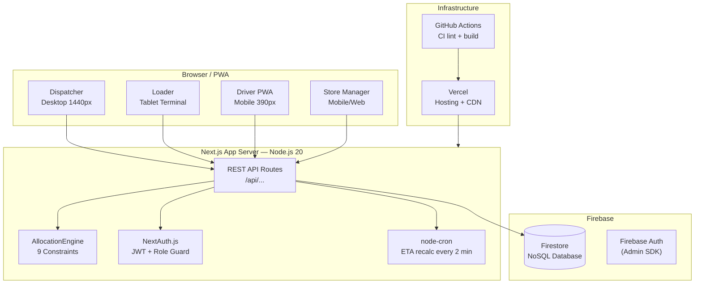
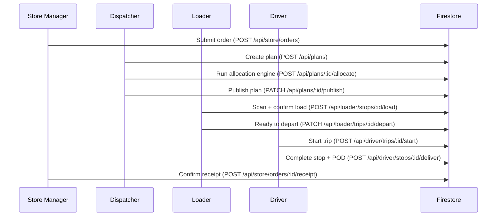

# Waypoint Flow — System Architecture

## System Overview

Waypoint Flow is a full-stack real-time delivery workflow management system for Waypoint Group — a Sri Lankan retail group operating three brands (Fresh, Style, Tech) across 12 districts from two depots.

## High-Level Architecture



## Delivery Workflow



## Role → Route Mapping

| Role | Interface | Route Prefix | Device |
|---|---|---|---|
| Dispatcher | Web App | `/dispatcher` | Desktop 1440px |
| Loader | Tablet Web | `/loader` | Shared tablet |
| Driver | PWA | `/driver` | Mobile 390px |
| Store Manager | Web/PWA | `/store` | Mobile or desktop |

## Technology Stack

| Layer | Technology | Version |
|---|---|---|
| Framework | Next.js (App Router) | 14.x |
| Language | TypeScript | 5.x |
| Styling | Tailwind CSS + shadcn/ui | 3.x |
| Database | Firebase Firestore | 12.x Admin SDK |
| Auth | NextAuth.js (JWT) | 4.x |
| Maps | Leaflet.js + OpenStreetMap | 1.9.x |
| Real-time | Firestore onSnapshot / REST polling | — |
| PWA/Offline | next-pwa + IndexedDB | — |
| Hosting | Vercel | — |
| CI | GitHub Actions | — |
| Containers | Docker + Docker Compose | — |

## Allocation Engine — 9 Constraints

```
C1: Depot match — vehicle and order from same depot
C2: Temperature — chilled orders → reefer vehicle only
C3: Van-only — van_only outlets → van type vehicles only
C4: Weight capacity — trip total ≤ vehicle weight capacity
C5: Volume capacity — trip total ≤ vehicle volume capacity
C6: Time budget — Fresh ≤ 270 min (03:30–08:00)
C7: Time budget — Style/Tech ≤ 480 min (09:00–17:00)
C8: Max 2 trips per vehicle per day
C9: One brand + one district per trip
```

## Real-Time Strategy

Vehicle position and status updates use **30-second polling** from the dispatcher client to `/api/dispatcher/overview`. This approach works on Vercel serverless (which does not support persistent WebSocket connections). Status changes in Firestore propagate within the next poll cycle.
