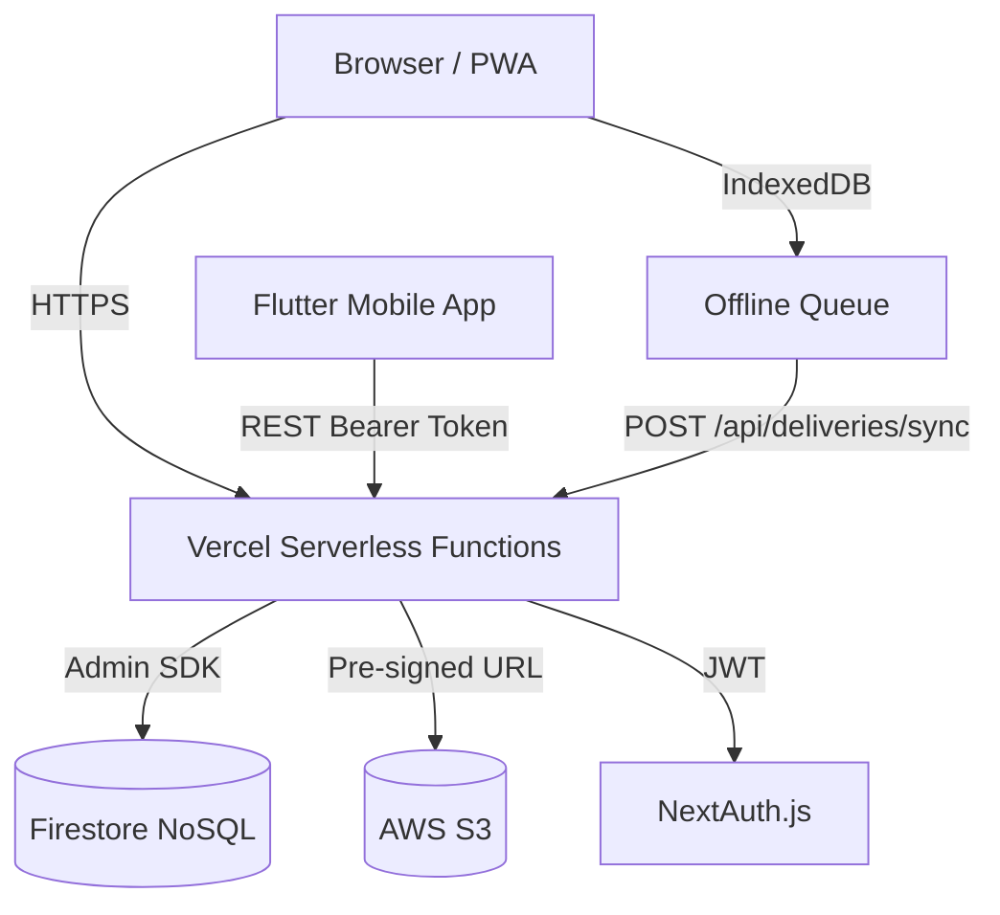

# Architecture

### Key Decisions
- **Firebase Firestore**: Chosen as the primary database for its real-time capabilities and ease of use. Avoids the need for a local database container.
- **Vercel Serverless**: Next.js API routes run as serverless functions. No persistent server process.
- **Polling-based fleet map**: The dispatcher map refreshes vehicle positions by polling `/api/dispatcher/overview`. Real-time Socket.IO updates require a persistent server and are not used.
- **Next.js App Router**: Provides SSR for the Dispatcher dashboard (data-dense) and CSR for the Driver PWA (needs offline capabilities via IndexedDB).
- **Flutter Mobile API**: A separate REST layer (`/api/mobile/v1/`) serves the Flutter companion app using Firebase custom token authentication.

