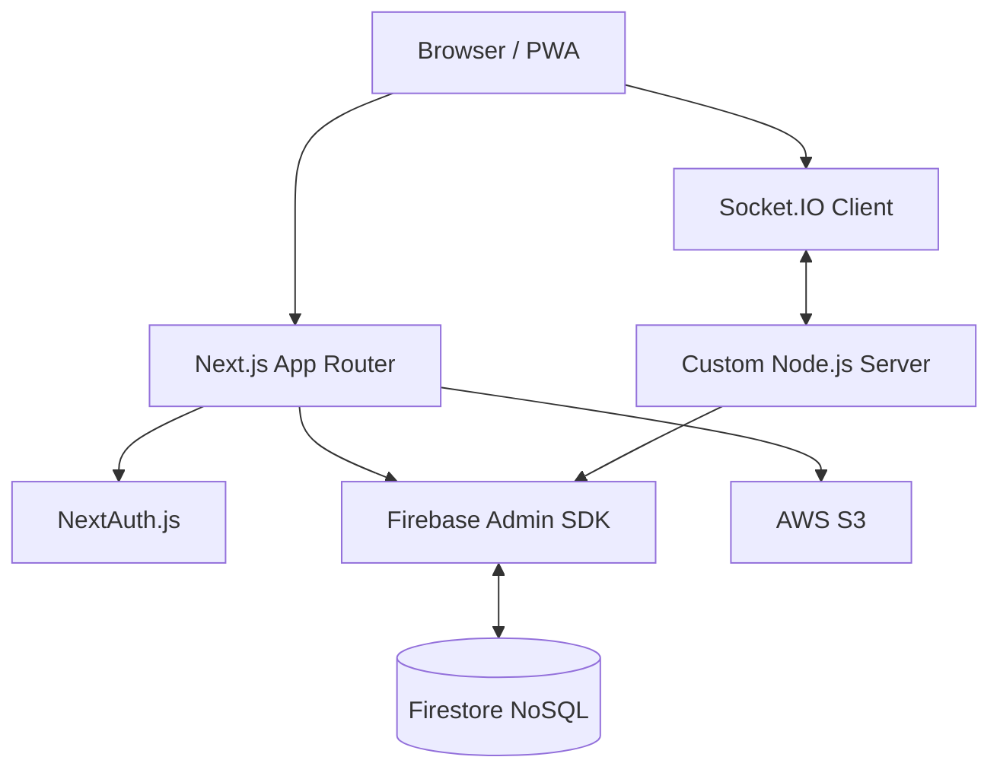

# Architecture

### Key Decisions
- **Firebase Firestore**: Chosen as the primary database for its real-time capabilities and ease of use in a hackathon setting. It avoids the need for a complex local database container.
- **Custom Node.js Server**: Used to host both the Next.js application and the Socket.IO server on the same port, enabling real-time WebSocket communication for the live vehicle map.
- **Next.js App Router**: Provides a mix of Server-Side Rendering (SSR) for the Dispatcher dashboard (data-dense) and Client-Side Rendering (CSR) for the Driver PWA (needs offline capabilities).
